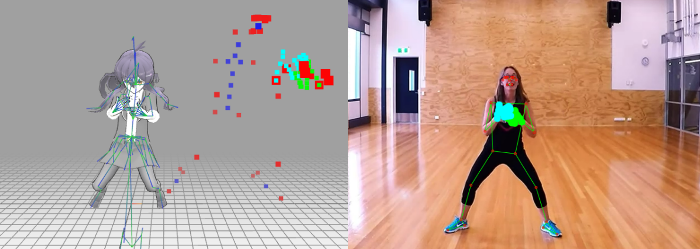

# MoCap

> skeleton position 정보와 MediaPipe Landmarks 정보를 활용하여 Rigging

### 개발 스택

- [three.js](https://threejs.org/)
- [MediaPipe](https://google.github.io/mediapipe/)

### 구현 내용

- 3D Scene 내 T-pose 상태인 아바타 bone들의 position과 MediaPipe Landmarks의 vector간 rotation matrix를 계산하여, 아바타 joint의 rotation 값을 조정
- 손목 rotation의 경우 손바닥을 기준으로 엄지, 중지 방향에 따라 local axis를 갖는 rotation matrix를 정해주고, 아바타 손목 rotation matrix가 MediaPipe 손목의 rotation matrix가 되도록 계산
- Three.js 에서 제공하는 mmd(miku-miku dance model)관련 함수들을 통해 physics를 활성화하고 inverse kinematics를 설정

### 예시 이미지

- Real-time MoCap

- Video MoCap using MMD model

